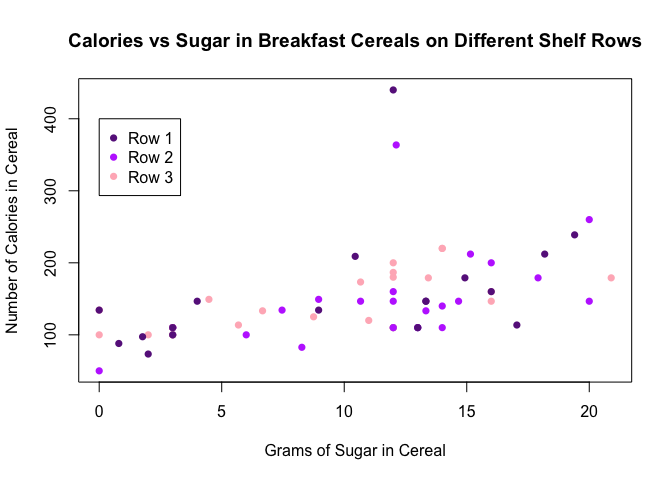
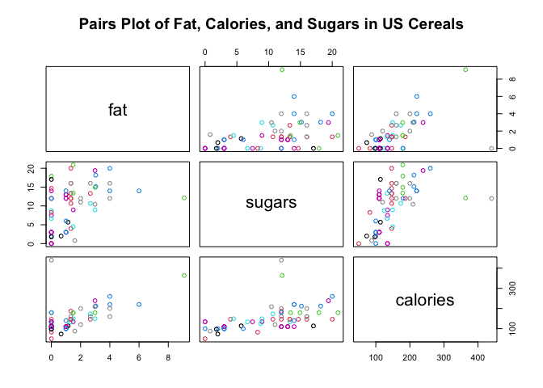
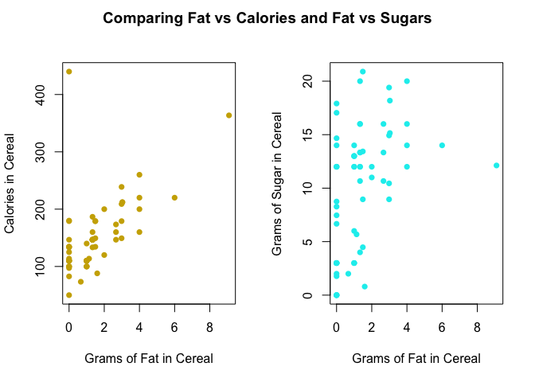
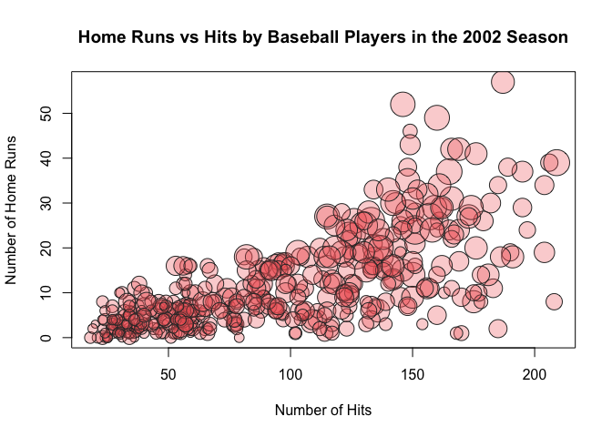

## Problem 1 (Verzani problem 5.1)
/__opt__aboutcom__coeus__resources__content_migration__serious_eats__seriouseats.com__images__2015__03__cereal-aisle-flickr-3b5bbd835bcb4bda817fd8277efd32c1.jpg)

*For the `UScereal` (**MASS**) data set, create a scatter plot of `calories` modeled by `sugars` using the `shelf` variable to create different plot characters. Add a legend to indicate the shelf number. Is there any patterns? (Use base R plotting for this problem.)*


```r
library(MASS)
plot(calories ~ sugars, data = UScereal, pch = 16, col = c('darkorchid4', 'darkorchid1', 'lightpink'),
     xlab = "Grams of Sugar in Cereal", ylab = "Number of Calories in Cereal", main = "Calories vs Sugar in Breakfast Cereals on Different Shelf Rows")
legend(0, 400, c('Row 1', 'Row 2', 'Row 3'), pch = 16, col = c('darkorchid4', 'darkorchid1', 'lightpink'), cex = 1)
```


<br/>

## Problem 2 (Verzani problem 5.3)
*For the data set `UScereal` (**MASS**) make a pairs plot of the numeric variables. Which correlation looks larger: fat and calories or fat and sugars?*


<br/>
$$ \\ \Large\text {US Cereal Table}$$

|                          |mfr | calories|   protein|      fat|   sodium|     fibre|    carbo|   sugars| shelf| potassium|vitamins |
|:-------------------------|:---|--------:|---------:|--------:|--------:|---------:|--------:|--------:|-----:|---------:|:--------|
|100% Bran                 |N   | 212.1212| 12.121212| 3.030303| 393.9394| 30.303030| 15.15152| 18.18182|     3| 848.48485|enriched |
|All-Bran                  |K   | 212.1212| 12.121212| 3.030303| 787.8788| 27.272727| 21.21212| 15.15151|     3| 969.69697|enriched |
|All-Bran with Extra Fiber |K   | 100.0000|  8.000000| 0.000000| 280.0000| 28.000000| 16.00000|  0.00000|     3| 660.00000|enriched |
|Apple Cinnamon Cheerios   |G   | 146.6667|  2.666667| 2.666667| 240.0000|  2.000000| 14.00000| 13.33333|     1|  93.33333|enriched |
|Apple Jacks               |K   | 110.0000|  2.000000| 0.000000| 125.0000|  1.000000| 11.00000| 14.00000|     2|  30.00000|enriched |
|Basic 4                   |G   | 173.3333|  4.000000| 2.666667| 280.0000|  2.666667| 24.00000| 10.66667|     3| 133.33333|enriched |
<br/>


<br/>



<br/>

## Problem 3 (Verzani problem 5.4)
*For the data set `batting` (**UsingR**) make a bubble plot of home runs hit (`HR`) modeled by hits (`H`) where the scale factor for each point is given by `sqrt(SO)/10`. Is there any story to be told by the size of the points? (You must use base R plotting for this problem.)*


```r
# Your code here
plot(HR~H, data = batting,
     pch = 21, #filled bubble
     col = "gray20",
     bg = rgb(.95,.4,.4,.3),
     cex = sqrt(SO/10), #idk if this is right
     xlab = "Number of Hits",
     ylab = "Number of Home Runs",
     main = "Home Runs vs Hits by Baseball Players in the 2002 Season"
)
```



