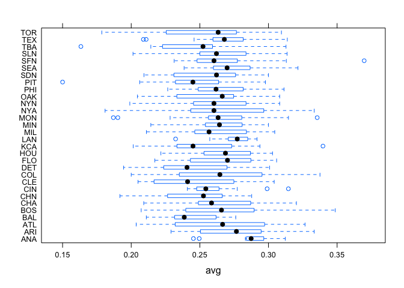
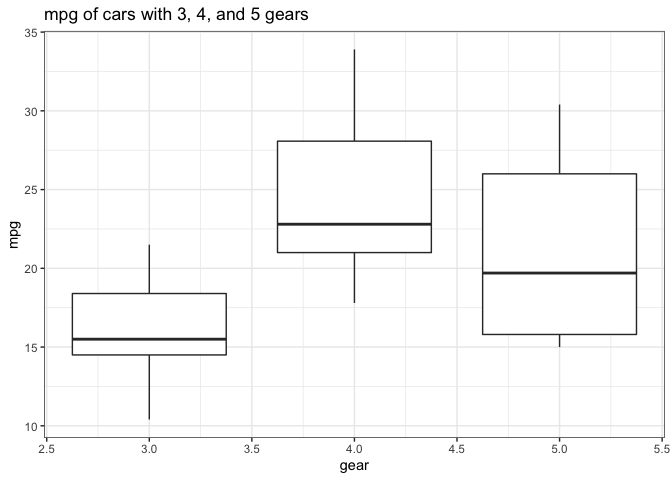
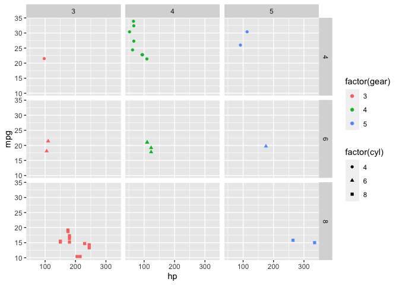
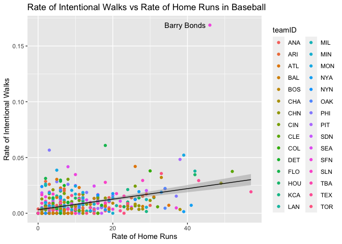

## Problem 1 (Verzani problem 5.6)
*For the `batting` (**UsingR**) data set, make parallel boxplots of the batting average (`H/AB`) for each team. Which team had the greatest median average? (Use **lattice** functions for this problem.)*


```r
avg = batting$H / batting$AB
bwplot(teamID~avg, data = batting)
```

<!-- -->
</br>
We see from the plot that team ANA has the highest median batting average
</br>

## Problem 2 (Verzani problem 5.7)
*For the `mtcars` data set, produce graphics of the following using **ggplot2**:*

1. *Boxplots for miles per gallon (`mpg`) for groups defined by the number of gears (`gear`).*


```r
library(ggplot2)
summary(mtcars)
```

```
##       mpg             cyl             disp             hp       
##  Min.   :10.40   Min.   :4.000   Min.   : 71.1   Min.   : 52.0  
##  1st Qu.:15.43   1st Qu.:4.000   1st Qu.:120.8   1st Qu.: 96.5  
##  Median :19.20   Median :6.000   Median :196.3   Median :123.0  
##  Mean   :20.09   Mean   :6.188   Mean   :230.7   Mean   :146.7  
##  3rd Qu.:22.80   3rd Qu.:8.000   3rd Qu.:326.0   3rd Qu.:180.0  
##  Max.   :33.90   Max.   :8.000   Max.   :472.0   Max.   :335.0  
##       drat             wt             qsec             vs        
##  Min.   :2.760   Min.   :1.513   Min.   :14.50   Min.   :0.0000  
##  1st Qu.:3.080   1st Qu.:2.581   1st Qu.:16.89   1st Qu.:0.0000  
##  Median :3.695   Median :3.325   Median :17.71   Median :0.0000  
##  Mean   :3.597   Mean   :3.217   Mean   :17.85   Mean   :0.4375  
##  3rd Qu.:3.920   3rd Qu.:3.610   3rd Qu.:18.90   3rd Qu.:1.0000  
##  Max.   :4.930   Max.   :5.424   Max.   :22.90   Max.   :1.0000  
##        am              gear            carb      
##  Min.   :0.0000   Min.   :3.000   Min.   :1.000  
##  1st Qu.:0.0000   1st Qu.:3.000   1st Qu.:2.000  
##  Median :0.0000   Median :4.000   Median :2.000  
##  Mean   :0.4062   Mean   :3.688   Mean   :2.812  
##  3rd Qu.:1.0000   3rd Qu.:4.000   3rd Qu.:4.000  
##  Max.   :1.0000   Max.   :5.000   Max.   :8.000
```

```r
p <- ggplot(mtcars, aes(y=mpg, x=gear)) + geom_boxplot(aes(group=gear)) + ggtitle("mpg of cars with 3, 4, and 5 gears") + theme_bw()
p
```

<!-- -->

3. *A scatterplot of `mpg` modeled by horsepower (`hp`). Create facets by the number of cylinders (`cyl`) and `gear`.*


```r
library(ggplot2)
p <- ggplot(mtcars) + geom_point(aes(x=hp, y=mpg, shape=factor(cyl), color=factor(gear))) + facet_grid(cyl ~ gear)
p
```

<!-- -->

## Problem 3
*Using the `batting` data set (UsingR), create a visualization that does the following:*

* *Plots the* rate *of intentional walks (that is, the number of intentional walks divided by the number of times a player was at bat; these are the `IBB` and `AB` variables in the data set, respectively) against the* rate *of home runs (the `HR` variable in the data set) as a scatterplot*

* *Draws a trend line for these variables*

* *Identifies and labels the outlier in the data set in these variables (easily spotted once the scatter plot is drawn)*

*(Hint: `geom`-type functions can accept data arguments and will use the data set passed rather than the default for the chart. So for the third requirement, consider adding a text layer with `geom_text(data = ..., aes(...))` where the argument passed to `data` is a subset of the data set consisting of the outlier, and `aes(...)` defines how to label that outlier.)*


```r
library(ggplot2)
library(UsingR)
outlier = data.frame(subset(batting, HR==46))
rateWalks = batting$IBB / batting$AB

p <- ggplot(batting, aes(x=HR, y=rateWalks)) +  geom_text(mapping = aes(label=ifelse(playerID=="bondsba01", "Barry Bonds", "")), hjust=1.1) +     
      geom_point(aes(color = teamID)) + geom_smooth(method="lm", color="black", size=.5) + 
      xlab("Rate of Home Runs") + ylab("Rate of Intentional Walks") + ggtitle("Rate of Intentional Walks vs Rate of Home Runs in Baseball")
p
```

```
## `geom_smooth()` using formula 'y ~ x'
```

<!-- -->

```r
head(batting)
```

```
##      playerID yearID stintID teamID lgID  G  AB  R  H DOUBLE TRIPLE HR RBI SB
## 157 youngdm01   2002       1    DET   AL 54 201 25 57     14      0  7  27  2
## 161 velarra01   2002       1    OAK   AL 56 133 22 30      8      0  2   8  3
## 162 tynerja01   2002       1    TBA   AL 44 168 17 36      2      1  0   9  7
## 163 thompry01   2002       1    MIL   NL 62 137 16 34      9      2  8  24  1
## 173 selbybi01   2002       1    CLE   AL 65 159 15 34      7      2  6  21  0
## 176 riverru01   2002       1    TEX   AL 69 158 17 33      4      0  4  14  4
##     CS BB SO IBB HBP SH SF GIDP
## 157  0 12 39   5   2  0  1   12
## 161  0 15 32   1   5  1  1    4
## 162  1  7 19   0   1  3  1    1
## 163  0  7 38   0   2  0  0    7
## 173  1 15 27   2   0  0  2    4
## 176  2 17 45   0   5  4  2    2
```

## BONUS Problem
*Reconsider the data set from a previous project containing data about the results of 2012 Olympics. I load the data in for you below:*


```r
#setwd("C:/Users/Chanel Roe/Desktop/MATH 3070 Fall 2018/Lecture_7") #you will need to change to working directory to your own computer.
#olympic2012 <- read.csv("olympic-medals2012.csv")
# Some variables are read in as strings when, in truth, they are numeric (they separate thousands with commas, leading to them being read as strings). I fix this below using the transform function, which allows for modifying columns in a data frame using methods similar to with.
#olympic2012 <- transform(olympic2012, GDP.2011 = as.numeric(gsub(",", "", GDP.2011)), pop.2010 = as.numeric(gsub(",", "", pop.2010)))
```

*Use any plotting system (base R, **lattice**, **ggplot2**) to create plot involving at least three variables in the `olympic2012` data set. Explain the relationship you explored and any interesting findings. **Bonus points will be given for plots that I consider exceptionally clean, clear, and insightful, accompanied with good analyses of what you found.***


```r
# Your code here
```
