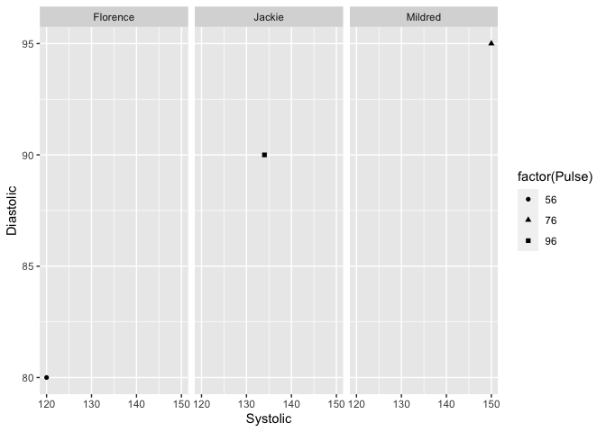

## Problem 1 (Verzani problem 3.2)
*For the `michelson` (**MASS**) data set, produce a density plot comparing `Speed` between Experiments 1 and 2.*


```r
library(ggplot2)
library(MASS)
data(michelson)
p = data.frame(subset(michelson, Expt==1 | Expt==2)) #isolate data for experiments 1 and 2
q <- ggplot(p, aes(x=Speed, fill=Expt)) + geom_density(alpha=.25) + ggtitle("Speed Density Plot Comparison for Experiments 1 and 2") 

q
```

<!-- -->
</br>

## Problem 2 (Verzani problem 3.4)
*Three students record the time spent on homework per class. Their data is:*

| Student| 1  | 2  | 3  | 4  | 5 |
|:-------|---:|---:|---:|---:|--:|
| Marsha | 25 | 0  | 45 | 90 | 0 |
| Bill   | 30 | 30 | 30 | 30 |   |
| Holly  | 15 | 0  | 90 | 0  |   |

*Use a list to store these values. Then create a boxplot to compare. (You must use `boxplot()`'s formula interface for this problem.)*


```r
name = c("Marsha", "Bill", "Holly")
class1 = c(25,30,15)
class2 = c(0,30,0)
class3 = c(45,30,90)
class4 = c(90,30,0)
class5 = c(0, NA, NA)
df = data.frame(name, class1, class2, class3, class4, class5)
boxplot(class1, class2, class3, class4, class5, names=c("Class 1", "Class 2", "Class 3", "Class 4", "Class 5"), ylab="Time Spent on Homework", col = c("#003f5c", "#58508d", "#bc5090", "#ff6361", "#ffa600"))
```

<!-- -->

</br>

## Problem 3 (Verzani problem 3.5)
*A group of nursing students take turns measuring some basic assessments. Their data is:*

|          | Temp | Pulse | Systolic | Diastolic |
|----------|------|-------|----------|-----------|
| Jackie   | 98.2 | 96    |  134     | 90        |
| Florence | 98.6 | 56    |  120     | 80        |
| Mildred  | 98.2 | 76    |  150     | 95        |

*Create a data frame of these values. Will `plot()` and `boxplot()` produce the same graphic?*


```r
library(ggplot2)
name = c("Jackie", "Florence", "Mildred")
Temp = c(98.2, 98.6, 98.2)
Pulse = c(96, 56, 76)
Systolic = c(134, 120, 150)
Diastolic = c(90, 80, 95)

df1 = data.frame(Temp, Pulse, Systolic, Diastolic) #include values only
df2 = data.frame(name, Temp, Pulse, Systolic, Diastolic) #include name

#Weird uninformative scatter plot thing?
plot(Systolic~Pulse, data = df2, pch = name)
```

<!-- -->

```r
#boxplot of values only
boxplot(df1)
```

<!-- -->

```r
#ggplot "scatter" plot
p <- ggplot(df2) + geom_point(aes(x=Systolic, y=Diastolic, shape=factor(Pulse))) + facet_grid( ~ name)
p
```

<!-- -->
</br>

## Problem 4 (Verzani problem 3.8)
*The second argument to `split` can be a list of factors. The result is that all interactions (possible combinations) are used for the groups. In the `ToothGrowth` data set, growth (`len`) is measured for two types of supplements (`supp`) and three doses (`dose`). Split this `len` value into 6 groups.*


```r
#split length according to supplements and dosage
supplement = ToothGrowth$supp
dose = ToothGrowth$dose
length = ToothGrowth$len
l = split(length, f = list(supplement, dose), drop=TRUE) 
print(l)
```

```
## $OJ.0.5
##  [1] 15.2 21.5 17.6  9.7 14.5 10.0  8.2  9.4 16.5  9.7
## 
## $VC.0.5
##  [1]  4.2 11.5  7.3  5.8  6.4 10.0 11.2 11.2  5.2  7.0
## 
## $OJ.1
##  [1] 19.7 23.3 23.6 26.4 20.0 25.2 25.8 21.2 14.5 27.3
## 
## $VC.1
##  [1] 16.5 16.5 15.2 17.3 22.5 17.3 13.6 14.5 18.8 15.5
## 
## $OJ.2
##  [1] 25.5 26.4 22.4 24.5 24.8 30.9 26.4 27.3 29.4 23.0
## 
## $VC.2
##  [1] 23.6 18.5 33.9 25.5 26.4 32.5 26.7 21.5 23.3 29.5
```
