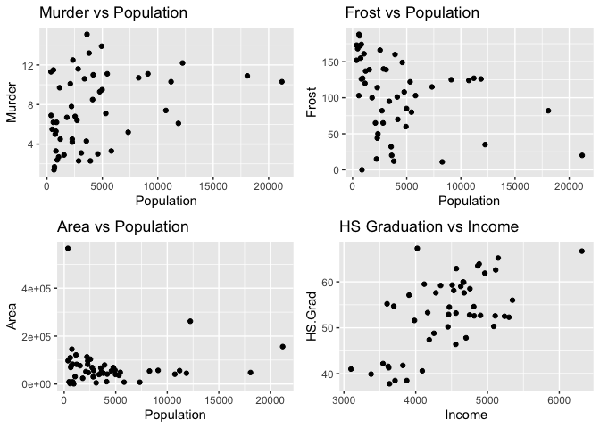
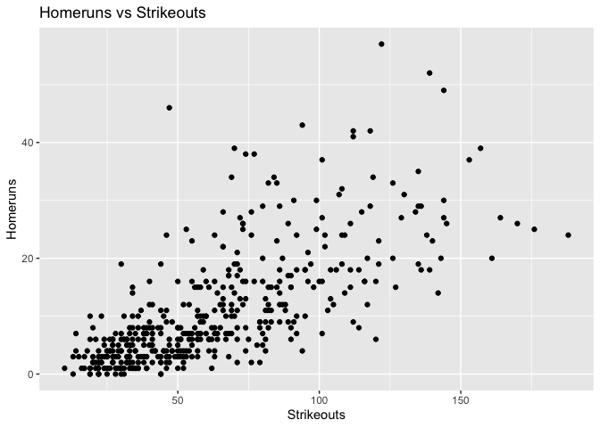
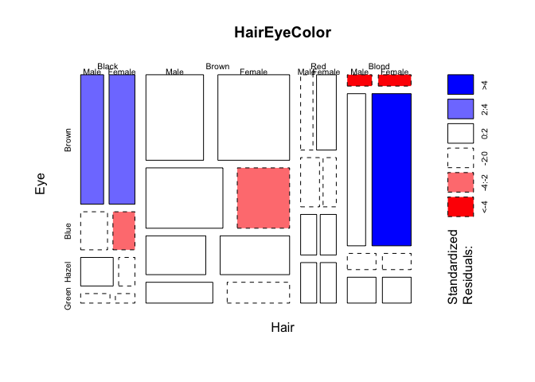

## Problem 1 (Verzani problem 3.17)
*The `state.x77` data set contains various information for each of the fifty United States. We wish to explore possible relationships among the variables. First, we make the data set easier to work with by turning it into a data frame.*


```r
x77 <- data.frame(state.x77)
```

*Now, make scatter plots of `Population` and `Frost`; `Population` and `Murder`; `Population` and `Area`; and `Income` and `HS.Grad`. Do any relationships appear linear? Are there any surprising correlations?*  


```r
p1 <- ggplot(x77, aes(x = Population, y=Murder)) + geom_point() + ggtitle("Murder vs Population") #pop X murder
p2 <- ggplot(x77, aes(x = Population, y=Frost)) + geom_point() + ggtitle("Frost vs Population") #pop X frost
p3 <- ggplot(x77, aes(x = Population, y=Area)) + geom_point() + ggtitle("Area vs Population") #pop X area
p4 <- ggplot(x77, aes(x = Income, y=HS.Grad)) + geom_point() + ggtitle("HS Graduation vs Income") #income X HS grad
grid.arrange(p1,p2,p3,p4)
```

<!-- -->

</br>

In the above plots we see a strong positive relation between High School graduation rates and Average State income. The other plots are not quite as explicit, however. There appears to be a slight positive relationship between murder rates and state population, and a slight negative relationship between frost and population. The Area vs Population chart has 3 distinct outliers; namely Alaska, Texas, and California, and the rest of the states appear clustered in the corner as a result.

</br>

## Problem 2 (Verzani problem 3.20)
*The `batting` (**UsingR**) data set contains baseball statistics for the 2002 Major League Baseball season. What is the correlation between the number of strikeouts (`SO`) and the number of home runs (`HR`)? Make a scatter plot to see whether there is any trend. Does the data suggest that in order to hit a lot of home runs one should strike out a lot?*


```r
p <- ggplot(batting, aes(x=SO, y=HR)) + geom_point() + ggtitle("Homeruns vs Strikeouts") + xlab("Strikeouts") + ylab("Homeruns")
p
```

<!-- -->

```r
correlation = cor(batting$SO, batting$HR)
correlation
```

```
## [1] 0.7084697
```
*ㅤㅤㅤㅤㅤㅤㅤㅤㅤㅤㅤㅤㅤㅤㅤㅤㅤㅤㅤㅤㅤㅤㅤㅤㅤ*
The data suggest a pretty strong positive relationship between strikeouts and home runs, and the calculated correlation is approximately 0.71. This is somewhat strange, as it would seem player performance is directly related to homeruns, and inversely related to strikeouts, so why the positive relationship between the two? My guess is the best players who hit the most home runs are simply at bat much more than players who frequently strike out, so their overall number of strikeouts is higher but their strikeouts:total bats may be much lower.

</br>

## Problem 3 (Verzani problem 3.32)
*The data set `UScereal` (**MASS**) contains information about cereals on a shelf of a United States grocery store. Make a table showing the relationship between manufacturer, `mfr`, and shelf placement, `shelf`. Are there any obvious differences between manufacturers?*


```r
table <- xtabs(~ mfr + shelf, data = UScereal)
table
```

```
##    shelf
## mfr  1  2  3
##   G  6  7  9
##   K  4  7 10
##   N  2  0  1
##   P  2  1  6
##   Q  0  3  2
##   R  4  0  1
```
We can see that manufacturer K heavily skews toward the middle and top shelves, with less than 20% of their cereals on the bottom shelf, and manufacturer Q exclusively displays on the top and middle shelves, although they have far smaller numbers than K. Manufacturer R, on the other hand, displays 4 out of their 5 cereals on the bottom shelf. Manufacturer G has a decent spread across all 3 shelves, slightly favoring the top shelf.

</br> 

## Problem 4 (Verzani problem 3.33)
*The help page for `mosaicplot()` demonstrates the data set `HairEyeColor`, which records `sex`, `Hair` color, and `Eye` color for 592 statistics students. The data set comes as a flattened table, so simply passing the object to `mosaicplot()` will create the plot. (Or, as demonstrated, passing `shade = TRUE`, as in `mosaicplot(HairEyeColor, shade = TRUE)`, will produce a colored version.)*
*Make the plot. Why does the help page note, "there are more blue-eyed, blonde females than expected?"*


```r
mosaicplot(HairEyeColor, shade = TRUE)
```

<!-- -->
</br>

We see that the box for blue-eyed, blonde females is a large, dark blue rectangle. This corresponds to a standardized residual of >4, meaning the observed value is much greater than the expected value for this piece of the data. Standardized residuals greater than 3 are typically considered to be outliers in a data set.
